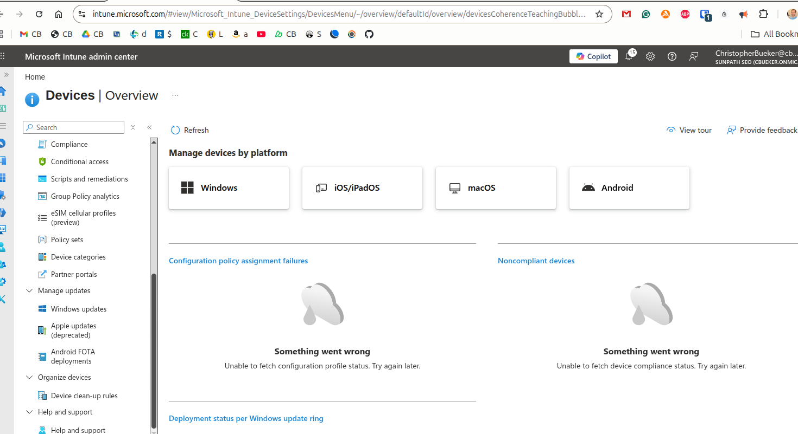

**Microsoft Intune endpoint administration lab**

## Lab Objectives

- Review device management by platform in Microsoft Intune
- Explore user administration and directory visibility
- Review group administration and tenant organization
- Create a Windows compliance policy workflow
- Understand how Intune supports endpoint governance

---

## Device Management Overview

This screenshot shows device management organized by platform in Microsoft Intune, including Windows, iOS/iPadOS, macOS, and Android.

---

## User Administration

This screenshot shows user administration inside Microsoft Intune, including Azure directory visibility, user identities, and account management.

---

## Group Administration

This screenshot shows group administration inside Microsoft Intune, including cloud groups, M365 groups, and tenant group overview.

## Windows Compliance Policy Creation

This screenshot shows Windows compliance policy setup inside Intune, including platform selection and compliance profile targeting.

## Key Skills Practiced

- Microsoft Intune navigation  
- Device compliance workflow  
- User and group administration  
- Endpoint policy structure  
- Windows endpoint governance 
